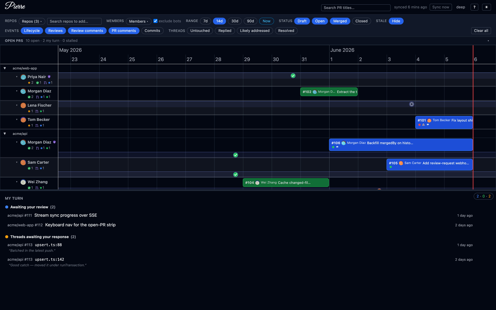
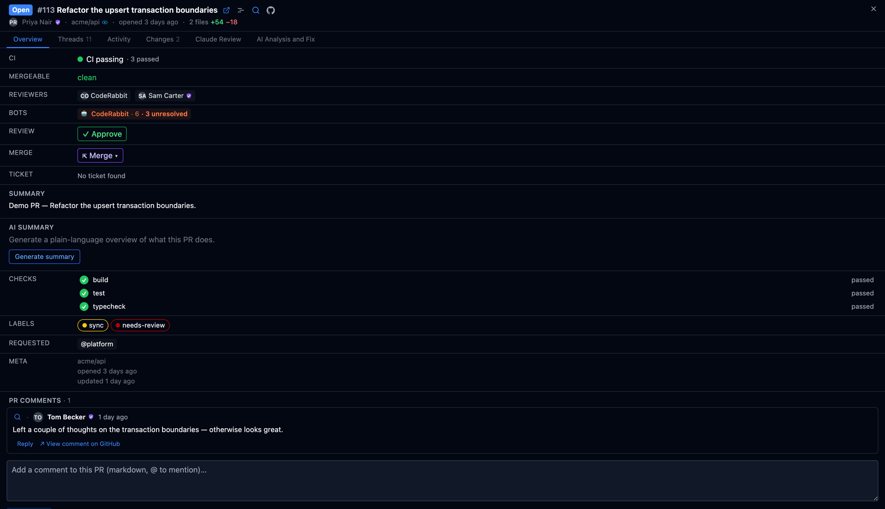
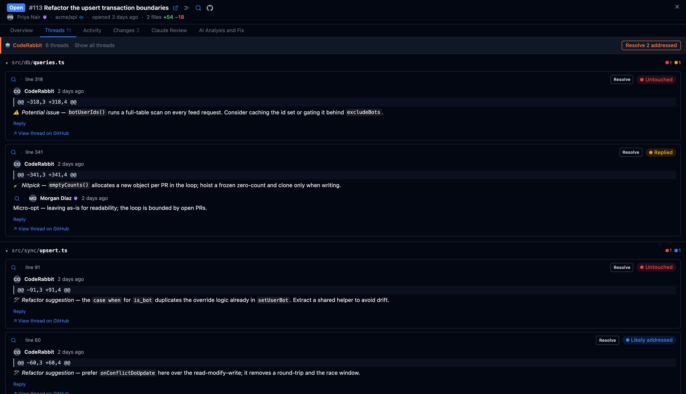
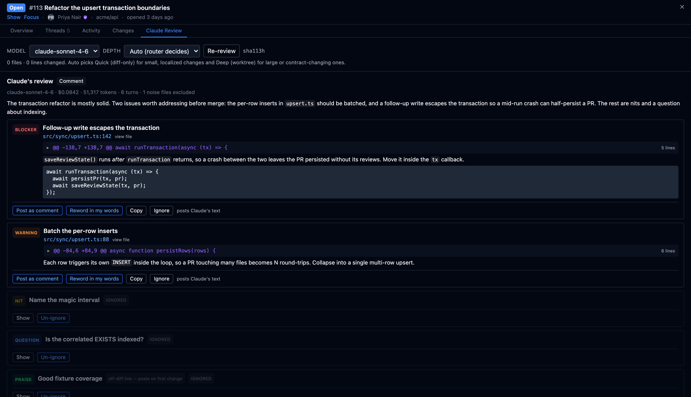

# pierre-review

**The calm layer above your review bot.** Bring your own reviewer — CodeRabbit,
Greptile, Copilot, whatever you run — and Pierre becomes the cross-repo triage
layer *above* it: what's stalled, whose turn it is, and which of the bot's comments
a human still needs to read. A single-page dashboard for a whole team's GitHub
activity across many repos: a horizontal timeline per repo, member sub-lanes, and
drill-down into PRs and review threads (read them in-app).

Third-party review-bot output (CodeRabbit · Greptile · Copilot · Qodo · Sourcery)
is a **first-class, triaged signal**, not generic noise: bot threads a later commit
has likely addressed vs the ones still needing a human, a per-vendor signal-to-noise
rate, and one-click bulk-resolve of the stale ones. Pierre's own agentic **Claude
Review** is just *one* optional reviewer you can plug in (BYO key) — never the point.

Runs two ways from one codebase (the `DEPLOYMENT_MODE` env var selects):

- **Local** (default): zero-config, SQLite, authenticates via your `gh` CLI.
  `npx pierre-review` opens straight to the timeline — no landing page, no
  accounts, no hosted backend.
- **Cloud** (multi-tenant): a public dark landing page, GitHub OAuth App sign-in,
  per-user encrypted accounts, and Postgres. Self-host on Railway. See
  [docs/DEPLOY-RAILWAY.md](docs/DEPLOY-RAILWAY.md).

> **☁️ Try it now — [pierre-review.com](https://pierre-review.com/)**
> A hosted instance of the cloud deployment is live. Sign in with GitHub, add the
> repos you want to watch, and get the full timeline dashboard — no install, no
> local setup. (Prefer to keep everything on your machine? Use local mode below.)

## Screenshots

The timeline — pull-request activity grouped **repo → contributor**, with shaped
review markers, the open-PR strip, and a **My Turn** triage panel:



Drill into any PR without leaving the dashboard — review threads grouped by file,
each tagged with its derived state (resolved · replied · likely-addressed ·
untouched), alongside CI, approvers, and the full activity feed:



Triage your review bot's firehose: a per-vendor chip counts its comments and how
many still need a human, and one click resolves the threads a later commit already
addressed:



## Prerequisites

- Node ≥ 20 (developed on 24)
- pnpm ≥ 9
- GitHub CLI (`gh`) authenticated: `gh auth login`. For org repos behind SSO you
  may need `gh auth refresh -h github.com -s read:org`. *(Local mode only — cloud
  mode uses a GitHub OAuth App instead.)*

## Quick start (local)

```bash
pnpm install
cp .env.example .env        # optional; sensible defaults otherwise
pnpm db:migrate             # create the SQLite schema
pnpm dev                    # backend :4000 + frontend :5173
```

Open http://localhost:5173. Add repos from the UI (owner/name); the first sync
backfills the last 90 days, then incremental sync runs every 5 minutes.

By default bulky text (comment/PR/review bodies, diff hunks) isn't stored — it's
fetched from GitHub when you open a PR and cached in the browser, keeping the DB
small and backfills fast. Set `PERSIST_BODIES=true` to store it locally (larger DB,
PR detail works fully offline). Same model in both modes; see CLAUDE.md.

### One-off sync without the server

```bash
pnpm sync:once owner/repo
pnpm db:studio              # inspect the data
```

## Claude Review (local only)

An opt-in feature that runs the **Claude Agent SDK** against a PR from its detail
pane: it produces structured review findings, lets you author your own review and
tick which findings to post inline, then submits **one** GitHub review. It spends
real Anthropic credits per run, so it's **off by default** and **local-only**
(force-disabled in cloud — see below).



Enable it by setting `ENABLE_CLAUDE_REVIEW=true`, plus an Anthropic auth source
(next section):

```bash
# dev
ENABLE_CLAUDE_REVIEW=true pnpm dev

# published CLI (npx, or the global `pierre`) — it's an env var, there is no flag
ENABLE_CLAUDE_REVIEW=true npx pierre-review
```

You can also put `ENABLE_CLAUDE_REVIEW=true` in `.env` (repo root) or
`apps/backend/.env`. When enabled, a **Claude Review** tab appears in the PR detail
pane.

### Anthropic auth — precedence order

Auth comes from the ambient environment; the first available source wins:

1. **User-supplied key** — pasted into the Claude Review tab, stored locally at
   `~/.pierre-review/config.json` (mode `0600`, never sent to any server). It
   overrides the ambient auth for the run.
2. **`ANTHROPIC_API_KEY`** environment variable.
3. **`CLAUDE_CODE_OAUTH_TOKEN`** environment variable.
4. **Ambient Claude Code session** — run `claude` once to sign in to an eligible
   plan (Pro / Max / Team / Enterprise); pierre-review detects the on-disk
   credentials under `~/.claude`.

If none is found, the tab explains how to set one up (the first real SDK call is the
authoritative check). The precedence and detection live in
`apps/backend/src/review/auth.ts` and `review/local-settings.ts`.

### Cloud: not available

Claude Review is **force-disabled in cloud mode**
(`config.claudeReviewEnabled = !isCloud && ENABLE_CLAUDE_REVIEW === 'true'`): the
routes are never registered and the tab is hidden, regardless of
`ENABLE_CLAUDE_REVIEW`. There is currently **no** way for cloud (multi-tenant) users
to bring their own Anthropic key to turn it on — it depends on a local `gh` CLI and a
writable clone directory, so it only runs in local mode.

## Cloud mode (multi-tenant)

The cloud deployment is Postgres-backed with GitHub OAuth App sign-in. Local mode is
untouched. To run the full deployed experience on your laptop:

```bash
docker compose up -d db                 # local Postgres (see docker-compose.yml)
cp .env.cloud.example .env              # fill in GITHUB_OAUTH_*, secrets, DATABASE_URL
DEPLOYMENT_MODE=cloud pnpm dev          # landing at /, app at /app, OAuth gate
```

Docs:

- [docs/DEPLOY-RAILWAY.md](docs/DEPLOY-RAILWAY.md) — deploy to Railway step by step.
- [docs/GITHUB-AUTH-SETUP.md](docs/GITHUB-AUTH-SETUP.md) — set up sign-in (OAuth App and/or GitHub App).
- [docs/LOCAL-CLOUD-TESTING.md](docs/LOCAL-CLOUD-TESTING.md) — test cloud locally.

Verify cross-account isolation (query-layer IDOR check):

```bash
pnpm --filter @pierre-review/backend verify:isolation
```

## Layout

- `apps/backend` — Fastify API, Drizzle + SQLite/Postgres, GitHub sync engine
- `apps/frontend` — React + Vite + Tailwind + vis-timeline dashboard (served at `/app`)
- `apps/landing` — public marketing landing page (cloud mode, served at `/`)
- `packages/shared` — API types shared by both sides

See `CLAUDE.md` for the architecture, conventions, and the local/cloud split.
