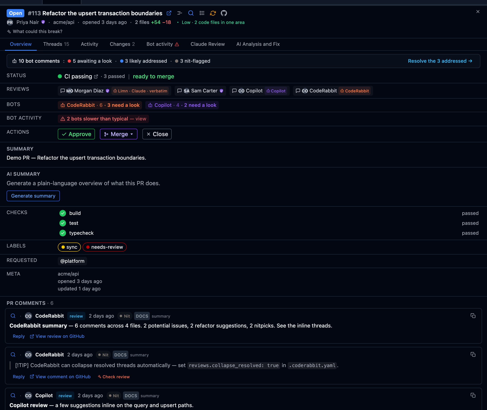
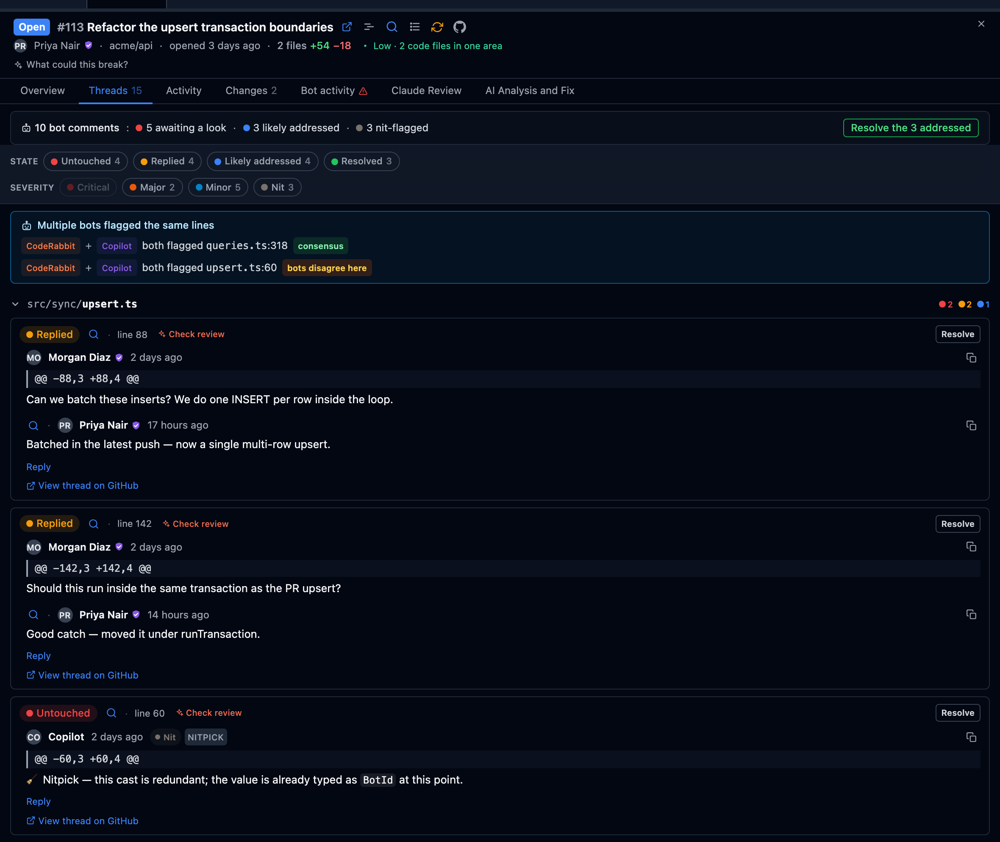

# Limn (`limn-review`)

**The calm layer above your review bot.** Bring your own reviewer — CodeRabbit,
Greptile, Copilot, whatever you run — and Pierre becomes the cross-repo triage
layer *above* it: what's stalled, whose turn it is, and which of the bot's comments
a human still needs to read. A single-page dashboard for a whole team's GitHub
activity across many repos: a horizontal timeline per repo, member sub-lanes, and
drill-down into PRs and review threads (read them in-app).

Third-party review-bot output (CodeRabbit · Greptile · Copilot · Qodo · Sourcery)
is a **first-class, triaged signal**, not generic noise: bot threads a later commit
has likely addressed vs the ones still needing a human, a per-vendor signal-to-noise
rate, and one-click bulk-resolve of the stale ones. On your own machine, **Claude
Review** and **AI Fix** run free on your own Claude Code or Anthropic API key — see
[Review and fix with Claude](#review-and-fix-with-claude-free-local).

Repos are organised into **Workspaces** — a named group of repos, and the one scope
the whole app runs on. Every repo lives in exactly one workspace (new repos land in
**Default**, which you can rename but not delete), so switching workspace re-scopes
the feed, the timeline, the metrics and the review-bot settings together. A
**Compare workspaces** view puts their flow metrics side by side once you have more
than one.

Runs two ways from one codebase (the `DEPLOYMENT_MODE` env var selects):

- **Local** (default): zero-config, SQLite, authenticates via your `gh` CLI.
  `npx limn-review` opens straight to the app — no landing page, no
  accounts, no hosted backend. (The package was `pierre-review`; that name is
  deprecated, and `~/.pierre-review` moves to `~/.limn` once, on first boot.)
- **Cloud** (multi-tenant): a public dark landing page, GitHub OAuth App sign-in,
  per-user encrypted accounts, and Postgres. Self-host on Railway. See
  [docs/DEPLOY-RAILWAY.md](docs/DEPLOY-RAILWAY.md).

> **☁️ Try it now — [pierre-review.com](https://pierre-review.com/)**
> A hosted instance of the cloud deployment is live. Sign in with GitHub, add the
> repos you want to track, and get the full timeline dashboard — no install, no
> local setup. (Prefer to keep everything on your machine? Use local mode below.)

## Screenshots

Pending — everything waiting on you or your workspace, across every repository, in
six ranked tabs:


Drill into any PR without leaving the dashboard — review threads grouped by file,
each tagged with its derived state (resolved · replied · likely-addressed ·
untouched), alongside CI, approvers, and the full activity feed:



Every review thread already triaged, and every bot comment graded for severity:



## Prerequisites

- Node ≥ 20 (developed on 24)
- pnpm ≥ 9
- GitHub CLI (`gh`) authenticated: `gh auth login`. For org repos behind SSO you
  may need `gh auth refresh -h github.com -s read:org`. *(Local mode only — cloud
  mode uses a GitHub OAuth App instead.)*

## Quick start (local)

```bash
pnpm install
cp .env.example .env        # optional; sensible defaults otherwise
pnpm db:migrate             # create the SQLite schema
pnpm dev                    # backend :4000 + frontend :5173
```

Open http://localhost:5173. Add repos from the UI (owner/name); the first sync
backfills the last 90 days, then incremental sync runs every 5 minutes.

By default bulky text (comment/PR/review bodies, diff hunks) isn't stored — it's
fetched from GitHub when you open a PR and cached in the browser, keeping the DB
small and backfills fast. Set `PERSIST_BODIES=true` to store it locally (larger DB,
PR detail works fully offline). Same model in both modes; see CLAUDE.md.

### One-off sync without the server

```bash
pnpm sync:once owner/repo
pnpm db:studio              # inspect the data
```

## Review and fix with Claude (free, local)

Every pull request gets a **Claude** tab when you run Limn on your own machine. It is
free and on by default — there is no flag to set.

- **Claude Review** — Claude reads the change and returns findings, each tied to a
  line. Tick the ones worth keeping and post them as **one** GitHub review. Paste in
  a story and it checks the change against it. **Auto review** reviews new pull
  requests as they arrive; it is off for every workspace until you switch it on.
- **Ask Claude** — a chat on the review, and on each finding.
- **AI Fix** — pick the review comments you want fixed. It edits a copy of the
  branch, shows you the diff, and pushes only when you click Push.

What the agents can do:

- The reviewer (and the chat) reads the code. It cannot edit files, run commands or
  reach the web.
- The fixer edits files. It has no shell, so it builds and tests nothing.
- Nothing is posted or pushed until you press the button.

### Your Claude, not ours

It runs on your own Claude Code or Anthropic API key. Limn stores no key and charges
nothing for it. Two sources, first one wins:

1. **Your Claude Code session** — run `claude` once to sign in (or set
   `CLAUDE_CODE_OAUTH_TOKEN`). When this is present, a run removes
   `ANTHROPIC_API_KEY` from its own environment so the session is used.
2. **`ANTHROPIC_API_KEY`** in the environment.

With neither, the Run button is replaced by one line: *Sign in to Claude Code or set
ANTHROPIC_API_KEY*. Detection lives in `apps/backend/src/review/auth.ts`.

### One-time setup

The npm package ships no AI SDKs, so `npx limn-review` stays small. The first time
you use review or fix, press **Set up AI** (a one-time download of about 110 MB), or
run:

```bash
npx limn-review ai install     # or `limn ai install` if installed globally
```

This installs exact, pinned versions of the Claude Agent SDK and its peers into
`~/.limn/ai-runtime`. From a checkout (`pnpm dev`) they resolve from `node_modules`
and there is nothing to install. To use the `claude` you already have installed
instead of the bundled one, set `LIMN_CLAUDE_PATH=/path/to/claude`.

To hide every review and fix surface, set `LIMN_AI_DISABLED=true`.

### Cloud: not available

Review and fix are **off in cloud mode** — the routes are not registered
(`config.isCloud`), and the hosted app says *Review and fix run on your machine:
npx limn-review*. They need a local clone directory and your own Claude, so they
only run locally.

With the Pro plugin present, a review can also fill its story from a linked Jira
ticket (including auto review). Without it, paste the story in.

## Bot-comment severity (dev / cloud only)

Review-bot comments can be scored for **severity** (nit → critical) and **category** by a small
local ML model, with badges on each comment and a rollup on the Bots tab. It is **free tier**,
uses no LLM and costs nothing — but it needs the `severity-api` service from the
[`pierre-ml`](https://github.com/alexwakeman/pierre-ml) repo, vendored here as the
`packages/ml` submodule, so it is **not available through `npx limn-review`** (the published
package ships no model). From a checkout with the submodule initialised
(`git submodule update --init packages/ml`):

```bash
SEVERITY_API_PORT=8799 packages/ml/scripts/serve_local.sh &
echo 'SEVERITY_API_URL=http://127.0.0.1:8799' >> .env
pnpm dev
```

Full setup, tuning and caveats: [docs/ML-SEVERITY.md](docs/ML-SEVERITY.md).

## Cloud mode (multi-tenant)

The cloud deployment is Postgres-backed with GitHub OAuth App sign-in. Local mode is
untouched. To run the full deployed experience on your laptop:

```bash
docker compose up -d db                 # local Postgres (see docker-compose.yml)
cp .env.cloud.example .env              # fill in GITHUB_OAUTH_*, secrets, DATABASE_URL
DEPLOYMENT_MODE=cloud pnpm dev          # landing at /, app at /app, OAuth gate
```

Docs:

- [docs/DEPLOY-RAILWAY.md](docs/DEPLOY-RAILWAY.md) — deploy to Railway step by step.
- [docs/GITHUB-AUTH-SETUP.md](docs/GITHUB-AUTH-SETUP.md) — set up sign-in (OAuth App and/or GitHub App).
- [docs/LOCAL-CLOUD-TESTING.md](docs/LOCAL-CLOUD-TESTING.md) — test cloud locally.

Verify cross-account isolation (query-layer IDOR check):

```bash
pnpm --filter @pierre-review/backend verify:isolation
```

## Layout

- `apps/backend` — Fastify API, Drizzle + SQLite/Postgres, GitHub sync engine
- `apps/frontend` — React + Vite + Tailwind + vis-timeline dashboard (served at `/app`)
- `apps/landing` — public marketing landing page (cloud mode, served at `/`)
- `packages/shared` — API types shared by both sides

See `CLAUDE.md` for the architecture, conventions, and the local/cloud split.

## License

Pierre is **source-available** under the [Functional Source License
(FSL-1.1-MIT)](./LICENSE). You may use, self-host, and modify it freely; you may
**not** offer it as a competing commercial or hosted product. Each release
automatically converts to the **MIT License** two years after its publication.

(The private `@pierre/pro` plugin is a separate, proprietary component and is not
covered by this license.)
